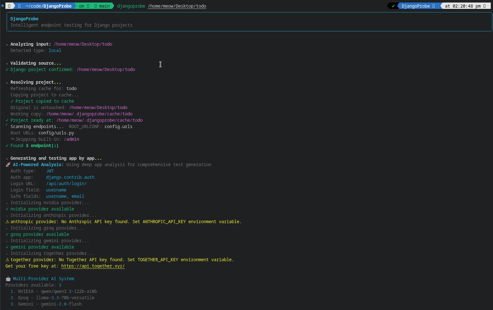
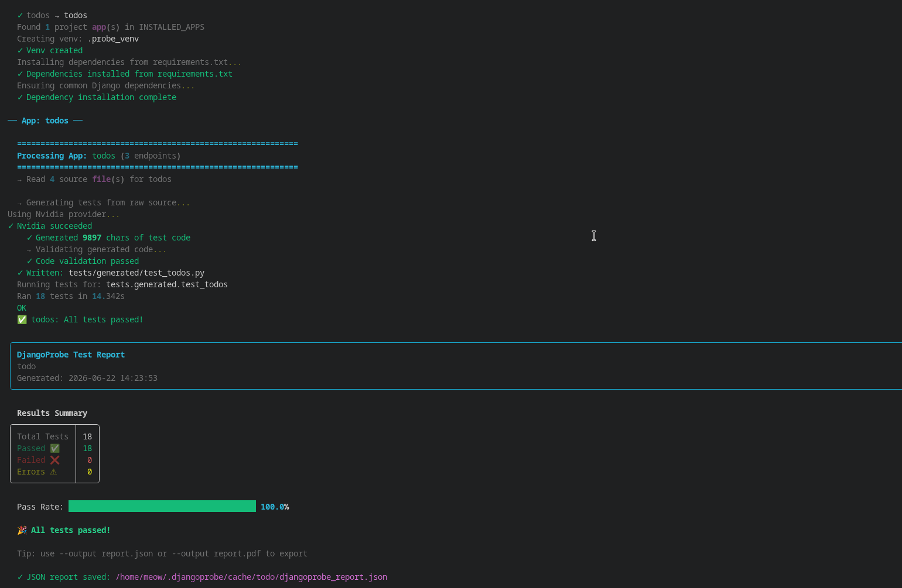

# DjangoProbe

AI-powered Django API test runner that automatically discovers endpoints, generates intelligent test cases, and executes them with detailed reporting.

## Features

- **Automatic Endpoint Discovery**: Scans Django projects to find all API endpoints
- **AI-Powered Deep App Analysis**: Uses AI APIs to analyze models, serializers, and views
- **Multi-Provider Support**: NVIDIA NIM (first priority), plus Groq, Gemini, Anthropic, and Together AI with automatic fallback
- **Intelligent Test Generation**: Generates comprehensive test cases based on code analysis
- **Per-App Testing**: Generates and runs tests for each Django app independently
- **Detailed Reporting**: Provides terminal reports with Rich formatting and JSON exports
- **Multiple Input Sources**: Supports local paths, GitHub, GitLab, and SSH URLs
- **Authentication Detection**: Automatically detects JWT, Token, and Session authentication

## Demo

Discovery, project analysis, and multi-provider setup:



Test generation, execution, and results summary:



## Quick Start

### Installation

**Linux / macOS (one line)** — bash/zsh:

```bash
git clone https://github.com/charitraa/DjangoProbe.git && cd DjangoProbe && python3 -m venv env && source env/bin/activate && pip install -r requirements.txt && pip install -e . && cp .env.example .env
```

**Windows (one line)** — PowerShell:

```powershell
git clone https://github.com/charitraa/DjangoProbe.git; cd DjangoProbe; python -m venv env; .\env\Scripts\Activate.ps1; pip install -r requirements.txt; pip install -e .; copy .env.example .env
```

Then open `.env` and add at least one provider API key (see [Configuration](#configuration)).

<details>
<summary>Step-by-step (if you prefer)</summary>

```bash
# Clone the repository
git clone https://github.com/charitraa/DjangoProbe.git
cd DjangoProbe

# Create virtual environment
python -m venv env
source env/bin/activate  # On Windows: .\env\Scripts\Activate.ps1

# Install dependencies
pip install -r requirements.txt
pip install -e .

# Create your config from the template
cp .env.example .env       # On Windows: copy .env.example .env
```

</details>

### Configuration

Create a `.env` file in your working directory. At least one provider must be
configured. **NVIDIA NIM is always tried first**; the others are used as
fallbacks and only run if their API key is present.

**Recommended: NVIDIA NIM (free tier, OpenAI-compatible)**
```env
AI_PREFERRED_PROVIDER=nvidia
NVIDIA_API_KEY=nvapi-your_key_here          # free key at https://build.nvidia.com
NVIDIA_MODEL=qwen/qwen3.5-122b-a10b         # copy the exact id from the model page
# NVIDIA_BASE_URL=https://integrate.api.nvidia.com/v1   # optional override (any OpenAI-compatible endpoint)
```

**Other providers (optional fallbacks — only run when their key is set)**
```env
GROQ_API_KEY=gsk_your_key_here
GROQ_MODEL=llama-3.3-70b-versatile
GEMINI_API_KEY=your_key_here
GEMINI_MODEL=gemini-2.0-flash
ANTHROPIC_API_KEY=your_key_here
ANTHROPIC_MODEL=claude-sonnet-4-6
TOGETHER_API_KEY=your_key_here
TOGETHER_MODEL=meta-llama/Meta-Llama-3.1-8B-Instruct-Turbo
```

Provider priority: **NVIDIA → Anthropic → Groq → Gemini → Together**. NVIDIA is
always first; `AI_PREFERRED_PROVIDER` can reorder the others but never displaces
NVIDIA. On any error or rate limit, the manager rotates to the next available
provider.

For detailed setup instructions, see [MULTI_PROVIDER_SETUP.md](docs/MULTI_PROVIDER_SETUP.md).

## Usage

### Basic Usage

```bash
# Analyze a local Django project
djangoprobe /path/to/your/django/project

# Analyze a GitHub repository
djangoprobe https://github.com/username/repository

# Analyze a GitLab repository
djangoprobe https://gitlab.com/username/repository

# Analyze using SSH URL
djangoprobe git@github.com:username/repository.git
```

### AI-Powered Analysis

DjangoProbe automatically performs deep app analysis:

```bash
# Analyze a local Django project
djangoprobe /path/to/your/django/project

# Analyze a GitHub repository
djangoprobe https://github.com/username/repository

# Analyze a GitLab repository
djangoprobe https://gitlab.com/username/repository

# Analyze using SSH URL
djangoprobe git@github.com:username/repository.git
```

**AI Analysis Features:**
- Deep analysis of models, serializers, and views
- AI-generated custom prompts for each app
- Better understanding of relationships and constraints
- More comprehensive test coverage
- App-specific test generation

For details on the analysis and generation pipeline, see the [How It Works](#how-it-works) section below.

## How It Works

DjangoProbe follows a modular pipeline with AI-powered deep app analysis:

### 1. Input Detection & Validation
- Detects input type (local path, GitHub URL, GitLab URL, SSH URL)
- Validates input format and accessibility

### 2. Repository Handling
- Local paths: Copies project to cache directory
- Remote URLs: Clones to cache directory
- Validates Django project presence (manage.py check)

### 3. Endpoint Scanning
- Recursively scans all `urls.py` files
- Detects DRF Routers, ViewSets, APIViews, function-based views
- Returns endpoint information including URL patterns, HTTP methods, auth requirements

### 4. Project Analysis
- Analyzes project ONCE before test generation
- Detects auth type (JWT/Session/Token)
- Finds auth app/module path and login URL
- Discovers safe User model fields (excludes ManyToMany for create_user())
- Identifies roles, FK fields, M2M fields

### 5. Single-Step Raw-Code Test Generation
- Reads each app's **raw source** — models.py, serializers.py, views.py, urls.py, plus any services/repositories/permissions/selectors/filters (file or package)
- Makes **one LLM call** with that raw code + a short, accurate prompt (real login URL/credential field, pagination shape, DRF facts)
- Lightly cleans the output, validates it, and applies a small write-time safety net
- Writes tests to `tests/generated/test_<app_name>.py`

### 6. Test Execution
- Runs tests app-by-app in isolated environment
- Creates `.probe_venv` directory for isolated Python environment
- Executes `python manage.py test <app_name> --keepdb`
- Parses test output into `TestResult` objects
- Saves error JSON files to `~/.djangoprobe/errors/`

### 7. Report Generation
- Generates terminal report with Rich formatting
- Exports JSON report to project root as `djangoprobe_report.json`

## Architecture

```
DjangoProbe/
├── ai_tester/
│   ├── __init__.py                 # Package initialization
│   ├── cli.py                      # Command-line interface
│   ├── endpoint_scanner.py         # Endpoint discovery
│   ├── repo_handler.py             # Repository management
│   ├── project_analyzer.py         # Global project analysis
│   ├── app_analyzer.py             # Deep app analysis
│   ├── enhanced_test_generator.py  # AI-powered test generation
│   ├── ai_helper.py               # AI API communication (multi-provider)
│   ├── providers/                 # Multi-provider system
│   │   ├── __init__.py
│   │   ├── base.py               # Provider interface
│   │   ├── nvidia_provider.py    # NVIDIA NIM implementation (first priority)
│   │   ├── groq_provider.py      # Groq implementation
│   │   ├── gemini_provider.py    # Gemini implementation
│   │   ├── anthropic_provider.py # Anthropic implementation
│   │   ├── together_provider.py  # Together AI implementation
│   │   └── manager.py            # Provider manager with fallback
│   ├── app_test_runner.py         # Test execution
│   ├── report.py                  # Report generation
│   └── models.py                 # Data models
├── docs/
│   └── MULTI_PROVIDER_SETUP.md   # Multi-provider setup guide
├── examples/
│   └── enhanced_mode_demo.py      # Analysis demo
├── .env.example                  # Configuration template
├── CLAUDE.md                     # Claude Code instructions
├── LICENSE                       # MIT license
└── requirements.txt               # Python dependencies
```

## Data Models

### EndpointInfo
```python
{
    "url_pattern": "/api/user/",
    "http_methods": ["GET", "POST"],
    "view_name": "UserViewSet",
    "requires_auth": True,
    "app_name": "user"
}
```

### TestResult
```python
{
    "endpoint": EndpointInfo,
    "status": "PASSED",  # or "FAILED", "ERROR"
    "response_code": 200,
    "expected_code": 200,
    "error_message": None
}
```

### ProjectAnalysis
```python
{
    "auth_type": "JWT",
    "login_url": "/api/user/login/",
    "auth_module": "apps.user",
    "auth_app_name": "user",
    "safe_user_fields": ["email", "full_name"],
    "roles": ["admin", "teacher", "student"],
    "user_fk_fields": [...],
    "user_m2m_fields": [...]
}
```

## Programmatic Usage

### Complete Workflow

```python
from ai_tester import (
    EndpointScanner,
    ProjectAnalyzer,
    EnhancedTestGenerator,
    AppTestRunner
)

# Scan endpoints
scanner = EndpointScanner("/path/to/project")
endpoints = scanner.scan()

# Analyze project
analyzer = ProjectAnalyzer("/path/to/project")
analysis = analyzer.analyze()

# Generate tests with AI-powered analysis
generator = EnhancedTestGenerator(
    "/path/to/project",
    endpoints,
    analysis
)
test_files = generator.generate()

# Run tests
runner = AppTestRunner("/path/to/project")
for test_file in test_files:
    results = runner.run_custom_test_label(test_file)
```

### Generate tests for a single app

```python
from ai_tester.enhanced_test_generator import EnhancedTestGenerator

# endpoints: list[EndpointInfo] from EndpointScanner; analysis: ProjectAnalysis
generator = EnhancedTestGenerator("/path/to/project", endpoints, analysis)

# Reads the app's raw source, makes one LLM call, writes the test file
test_file = generator.generate_for_app("blog", app_endpoints)
print(f"Wrote: {test_file}")
```

## Example Output

```
============================================================
DjangoProbe - Intelligent endpoint testing for Django projects
============================================================

→ Analyzing input: /home/user/myproject
  Detected type: LOCAL

→ Validating source...
✓ Django project confirmed: /home/user/myproject

→ Resolving project...
✓ Project ready at: /home/user/.djangoprobe/cache/myproject

→ Scanning endpoints...
  Root URLs: myproject/urls.py
✓ Found 12 endpoint(s)

→ Generating and testing app by app...

━━━━━━━━━━━━━━━━━━━━━━━━━━━━━━━━━━━━━━━━━━━━━━━━━━━━
  Processing App: user (5 endpoints)
━━━━━━━━━━━━━━━━━━━━━━━━━━━━━━━━━━━━━━━━━━━━━━━━━━━━

  [dim]Read:[/dim] user/models.py [dim](2450 chars)[/dim]
  [dim]Read:[/dim] user/serializers.py [dim](1800 chars)[/dim]
  [dim]Read:[/dim] user/views.py [dim](3200 chars)[/dim]
  [dim]Read:[/dim] user/urls.py [dim](450 chars)[/dim]
  [dim]→ Generating AI prompt for user...[/dim]
  [green]✓ AI prompt generated (3200 chars)[/green]
  [dim]→ Generating test cases using AI prompt...[/dim]
  [green]✓ Generated 4500 chars of test code[/green]
  [green]✓ Written:[/green] tests/generated/test_user.py

  [dim]Running tests for:[/dim] tests.generated.test_user
  [dim]Ran 12 tests in 2.345s[/dim]
  [green]OK[/green]
  ✅ user: All tests passed!

━━━━━━━━━━━━━━━━━━━━━━━━━━━━━━━━━━━━━━━━━━━━━━━━━━━━
  Processing App: product (7 endpoints)
━━━━━━━━━━━━━━━━━━━━━━━━━━━━━━━━━━━━━━━━━━━━━━━━━━━━

  [dim]Read:[/dim] product/models.py [dim](3100 chars)[/dim]
  [dim]Read:[/dim] product/serializers.py [dim](2100 chars)[/dim]
  [dim]Read:[/dim] product/views.py [dim](2800 chars)[/dim]
  [dim]Read:[/dim] product/urls.py [dim](380 chars)[/dim]
  [dim]→ Generating AI prompt for product...[/dim]
  [green]✓ AI prompt generated (2800 chars)[/green]
  [dim]→ Generating test cases using AI prompt...[/dim]
  [green]✓ Generated 5200 chars of test code[/green]
  [green]✓ Written:[/green] tests/generated/test_product.py

  [dim]Running tests for:[/dim] tests.generated.test_product
  [dim]Ran 18 tests in 3.123s[/dim]
  [green]OK[/green]
  ✅ product: All tests passed!

━━━━━━━━━━━━━━━━━━━━━━━━━━━━━━━━━━━━━━━━━━━━━━━━━━━━
                      Test Results Summary
━━━━━━━━━━━━━━━━━━━━━━━━━━━━━━━━━━━━━━━━━━━━━━━━━━━━

  ✅ Total Tests: 30
  ✅ Passed: 30
  ❌ Failed: 0
  ⚠️  Errors: 0

  📊 Success Rate: 100.0%

  📄 Report saved to: /home/user/myproject/djangoprobe_report.json
```

## Requirements

- Python 3.8+
- Django 3.0+
- Django REST Framework 3.0+
- AI Provider (one or more):
  - **NVIDIA NIM** (free tier, recommended) - Get a key at [build.nvidia.com](https://build.nvidia.com)
  - **Groq API key** (free tier) - Get from [console.groq.com](https://console.groq.com)
  - **Gemini API key** (free tier) - Get from [aistudio.google.com](https://aistudio.google.com)
  - **Anthropic API key** - Get from [console.anthropic.com](https://console.anthropic.com)
  - **Together AI key** (free tier) - Get from [api.together.xyz](https://api.together.xyz)

## Configuration Options

### Environment Variables

**AI Provider Selection:**
- `AI_PREFERRED_PROVIDER`: auto (default), nvidia, anthropic, groq, gemini, together
  (NVIDIA is always first priority regardless of this setting; it reorders the others)

**Provider Configuration:**
- `NVIDIA_API_KEY`: Your NVIDIA NIM key (starts with `nvapi-`)
- `NVIDIA_MODEL`: NVIDIA model (default: `qwen/qwen3.5-122b-a10b`)
- `NVIDIA_BASE_URL`: Optional endpoint override (default: `https://integrate.api.nvidia.com/v1`)
- `GROQ_API_KEY` / `GROQ_MODEL`: Groq key and model (default: `llama-3.3-70b-versatile`)
- `GEMINI_API_KEY` / `GEMINI_MODEL`: Gemini key and model (default: `gemini-2.0-flash`)
- `ANTHROPIC_API_KEY` / `ANTHROPIC_MODEL` / `ANTHROPIC_BASE_URL`: Anthropic config
- `TOGETHER_API_KEY` / `TOGETHER_MODEL`: Together key and model

**Retry Configuration:**
- `AI_MAX_RETRIES`: Maximum retry attempts (default: 3)
- `AI_RETRY_DELAY`: Delay between retries in seconds (default: 60)

### CLI Options

```bash
djangoprobe SOURCE

Options:
  --help, -h         Show help message and exit
```

## Troubleshooting

### Common Issues

**Issue**: "No AI providers available"
- **Solution**: Configure at least one provider key in `.env` (NVIDIA, Groq, Gemini, Anthropic, or Together)

**Issue**: "Rate limit exceeded"
- **Solution**: Configure multiple providers for automatic fallback. NVIDIA NIM's free tier is the recommended primary.

**Issue**: Tests fail to run
- **Solution**: Ensure project has valid `manage.py` and all dependencies are installed

**Issue**: Authentication fails in tests
- **Solution**: Verify login URL is correctly detected and User model fields match

**Issue**: Analysis takes a long time
- **Solution**: This is expected - DjangoProbe performs deep code analysis for comprehensive test coverage. The time varies based on app complexity and AI provider speed.

**Issue**: AI provider errors (503, 429)
- **Solution**: The system will automatically rotate to the next available provider. Configure multiple providers for better reliability.

## Performance

### Analysis & Generation (per app)
- Deep App Analysis: ~5-10 seconds
- AI Prompt Generation: ~10-20 seconds
- Test Case Generation: ~20-40 seconds
- Execution: ~2-5 seconds

### Total Time per App
- Simple apps: ~35-70 seconds
- Complex apps: ~60-120 seconds

**Note**: Performance varies based on:
- App complexity (number of models, serializers, views)
- Codebase size
- Network latency for AI API calls
- Groq API rate limits

## Contributing

Contributions are welcome! Please see [CONTRIBUTING.md](CONTRIBUTING.md) for guidelines.

## License

MIT License - see LICENSE file for details

## Acknowledgments

- **NVIDIA NIM**: For the free, OpenAI-compatible inference endpoint
- **Groq API**: For providing fast, free AI API access
- **Together AI**: For providing excellent free tier AI services
- **Django REST Framework**: For the excellent API framework
- **Rich**: For beautiful terminal output
- **Typer**: For the elegant CLI framework

## Support

For issues, questions, or contributions:
- GitHub Issues: https://github.com/charitraa/DjangoProbe/issues
- Multi-provider setup: See [docs/MULTI_PROVIDER_SETUP.md](docs/MULTI_PROVIDER_SETUP.md)

## Roadmap

- [ ] Support for GraphQL endpoints
- [ ] Performance testing generation
- [ ] Integration testing across related apps
- [ ] CI/CD integration
- [ ] Web dashboard for test results
- [ ] Custom test templates
- [ ] Parallel test execution
